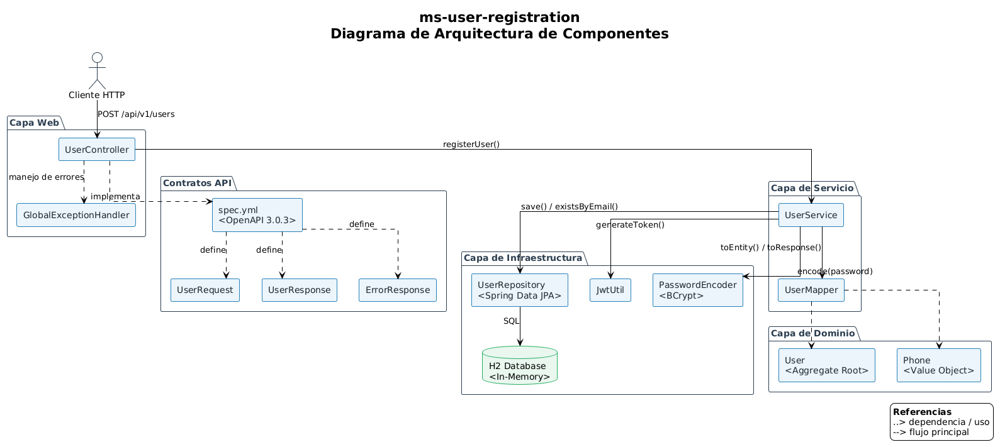
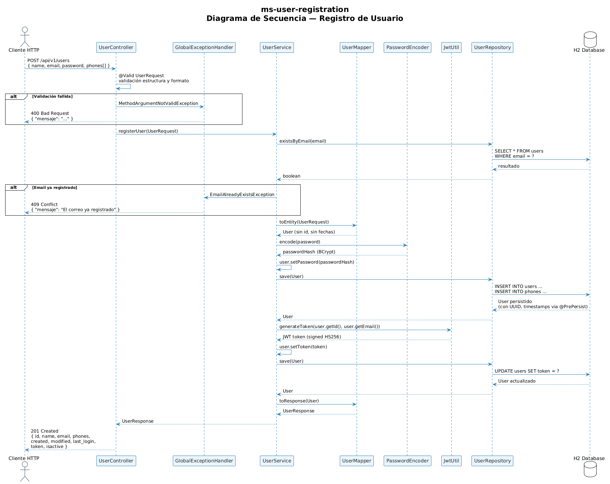

# ms-user-registration

> Microservicio de registro de usuarios.

API RESTful con registro de JWT, validaciones y documentación OpenAPI 3.0.

---

## 🏦 Descripción

Servicio encargado de la creación de nuevos usuarios en el sistema. Expone un único endpoint de registro que valida formato de correo electrónico, formato de contraseña segura y unicidad del correo. Así mismo, 
controla la validación del objeto Phone en el contexto del array que considera la request.
Retorna el usuario creado junto con un token JWT de acceso.

**Características principales:**

- Validación de formato de correo (`aaaaaaa@dominio.cl`)
- Validación de contraseña segura (mínimo una mayúscula, letras minúsculas, al menos dos números)
- Detección de correos duplicados con respuesta `409`
- Generación de token JWT en el registro
- Documentación interactiva OpenAPI 3.0 con Swagger UI
- Pruebas unitarias y de integración
- Script SQL para creación de base de datos
- Diagramas de arquitectura y servicio

---

## 🛠️ Stack Tecnológico

| Tecnología | Versión | Propósito |
|---|---|---|
| Java | 17 | Lenguaje de programación |
| Spring Boot | 3.1.5 | Framework de aplicación |
| Spring Data JPA | 3.1.5 | Persistencia y ORM |
| Hibernate | 6.2.13 | Proveedor JPA |
| H2 Database | — | Base de datos en memoria |
| JWT (`io.jsonwebtoken`) | 0.11.5 | Generación de tokens |
| MapStruct | 1.5.5 | Mapeo DTO ↔ Entity |
| OpenAPI Generator | 7.2.0 | Generación de código desde spec |
| SpringDoc OpenAPI | 2.2.0 | Swagger UI |
| Lombok | — | Reducción de boilerplate |
| JUnit 5 | — | Testing |
| Gradle | 8.2.1 | Build tool |

---

## 📁 Estructura del Proyecto

```
ms-user-registration/
├── src/
│   ├── main/
│   │   ├── java/cl/banking/users/
│   │   │   ├── config/          # Configuración (Security, JWT, Properties)
│   │   │   ├── controller/      # Controladores REST
│   │   │   ├── domain/          # Entidades JPA (User, Phone)
│   │   │   ├── exception/       # Excepciones y manejo global
│   │   │   ├── mapper/          # MapStruct converters
│   │   │   ├── repository/      # Repositorios Spring Data
│   │   │   ├── service/         # Lógica de negocio
│   │   │   └── util/            # Utilidades (JWT)
│   │   └── resources/
│   │       ├── api/             # OpenAPI spec (spec.yml)
│   │       ├── diagram/         # Diagramas PlantUML
│   │       ├── static/diagrams/ # Imágenes de diagramas
│   │       ├── application.yml
│   │       ├── application-dev.yml
│   │       └── schema.sql
│   └── test/
│       ├── java/cl/banking/users/
│       │   ├── config/
│       │   ├── controller/      # Tests de integración
│       │   ├── mapper/
│       │   ├── service/
│       │   └── util/
│       └── resources/
│           └── json/            # Payloads para tests
├── build.gradle
├── settings.gradle
└── README.md
```

---

## 📊 Diagramas de Solución

### Diagrama de Componentes


### Diagrama de Servicio


> Los archivos fuente PlantUML están disponibles en `src/main/resources/diagram/`:
> `DiagramaComponentes.puml` · `DiagramaServicio.puml`

---

## 🚀 Instalación y Ejecución

### Requisitos previos

- Java 17+
- Git

### Clonar el repositorio

```bash
git clone git@github.com:miguelgajardo/ms-user-registration.git
cd ms-user-registration
```

### Generar código OpenAPI

El proyecto utiliza OpenAPI Generator para crear DTOs e interfaces desde la especificación. Puede ejecutarse de forma aislada:

```bash
./gradlew openApiGenerate
```

El código generado se ubica en `build/generated/openapi/src/main/java/`.

### Construir

```bash
./gradlew clean build
```

### Ejecutar

```bash
./gradlew bootRun
```

La aplicación estará disponible en `http://localhost:8080/ms-user-registration`.

### Tests

```bash
# Todos los tests
./gradlew test

# Tests específicos
./gradlew test --tests UserMapperTest
./gradlew test --tests UserControllerIntegrationTest
./gradlew test --tests JwtUtilTest
```

Los reportes se generan en `build/reports/tests/test/index.html`.

---

## 📡 API

### `POST /api/v1/users` — Registrar usuario

**Request:**

```json
{
  "name": "Juan Rodriguez",
  "email": "juan@dominio.cl",
  "password": "Hunter12",
  "phones": [
    {
      "number": "1234567",
      "citycode": "1",
      "contrycode": "57"
    }
  ]
}
```

**Response `201 Created`:**

```json
{
  "id": "550e8400-e29b-41d4-a716-446655440000",
  "name": "Juan Rodriguez",
  "email": "juan@dominio.cl",
  "phones": [
    {
      "number": "1234567",
      "citycode": "1",
      "contrycode": "57"
    }
  ],
  "created": "2024-01-15T10:30:00",
  "modified": "2024-01-15T10:30:00",
  "last_login": "2024-01-15T10:30:00",
  "token": "eyJhbGciOiJIUzI1NiJ9...",
  "isactive": true
}
```

**Respuestas de error:**

| Código | Motivo | Mensaje |
|---|---|---|
| `400` | Validación de formato | `"El formato del correo no es válido"` |
| `409` | Email duplicado | `"El correo ya está registrado"` |
| `500` | Error interno | `"Error interno del servidor"` |

### Documentación interactiva

Con la aplicación en ejecución:

- **Swagger UI:** `http://localhost:8080/ms-user-registration/swagger-ui.html`
- **OpenAPI JSON:** `http://localhost:8080/ms-user-registration/api-docs`
- **Spec fuente:** `src/main/resources/api/spec.yml`

---

## 🗄️ Base de Datos

El esquema DDL está en `src/main/resources/schema.sql`:

```sql
CREATE TABLE IF NOT EXISTS users (
    id UUID PRIMARY KEY,
    name VARCHAR(50) NOT NULL,
    email VARCHAR(50) NOT NULL UNIQUE,
    password VARCHAR(255) NOT NULL,
    created_at TIMESTAMP NOT NULL,
    modified_at TIMESTAMP NOT NULL,
    last_login TIMESTAMP NOT NULL,
    token VARCHAR(512),
    is_active BOOLEAN NOT NULL DEFAULT TRUE
);

CREATE INDEX IF NOT EXISTS idx_email ON users(email);
CREATE INDEX IF NOT EXISTS idx_token ON users(token);

CREATE TABLE IF NOT EXISTS user_phones (
    user_id UUID NOT NULL,
    number VARCHAR(15) NOT NULL,
    city_code VARCHAR(5) NOT NULL,
    country_code VARCHAR(4) NOT NULL,
    FOREIGN KEY (user_id) REFERENCES users(id) ON DELETE CASCADE
);

CREATE INDEX IF NOT EXISTS idx_user_phones_user_id ON user_phones(user_id);
```

**Índices definidos:**

- `idx_email` en `users(email)` — búsqueda de duplicados en registro
- `idx_token` en `users(token)` — búsqueda de sesiones activas
- `idx_user_phones_user_id` en `user_phones(user_id)` — carga de teléfonos por usuario

---

## 🧪 Cobertura de Tests

| Clase | Tipo | Qué valida |
|---|---|---|
| `UserMapperTest` | Unitario | Mapeo DTO ↔ Entity, manejo del typo `contrycode` |
| `JwtUtilTest` | Unitario | Generación y validación de token JWT |
| `PasswordEncoderTest` | Unitario | Encriptación BCrypt |
| `UserServiceImplTest` | Unitario | Lógica de registro con mocks |
| `UserControllerIntegrationTest` | Integración | Flujo completo de registro |

---

## 🏗️ Decisiones de Arquitectura

### Value Object: `Phone`

`Phone` se implementa como `@Embeddable` (Value Object) sin identidad propia. Pertenece al agregado `User` y no tiene ciclo de vida independiente, siguiendo los principios de Domain-Driven Design.

### Typo `contrycode`

La especificación original contiene un error tipográfico (`contrycode` en lugar de `countrycode`). La decisión tomada fue:

- Mantener el typo en el contrato JSON para preservar compatibilidad con la spec
- Usar `countryCode` internamente en la capa de dominio
- MapStruct gestiona la conversión bidireccional de forma transparente

### Separación de validaciones por capa

- **DTOs** → validaciones de formato (`@Pattern`, `@Email`) — capa de presentación
- **Entidades** → restricciones de integridad (`nullable = false`, `unique = true`) — capa de dominio
- **Servicio** → validaciones de negocio (email duplicado) — capa de aplicación

### Token JWT

Almacenado junto al usuario según el requisito del desafío. En un contexto de producción, se recomienda separarlo en una entidad `UserSession` para soportar múltiples dispositivos y cumplir con PCI-DSS.

---

## 🔧 Configuración

### Perfiles de Spring

| Perfil | Archivo | Propósito |
|---|---|---|
| `dev` | `application-dev.yml` | Desarrollo local con H2 |
| `default` | `application.yml` | Configuración base |

### Variables de entorno

| Variable | Default | Descripción |
|---|---|---|
| `TOKEN_SECRET` | *(hash predefinido)* | Clave secreta para firma JWT HS256 |

---

## 📝 Licencia

Este proyecto fue desarrollado como parte de un desafío técnico y no cuenta con licencia específica.
